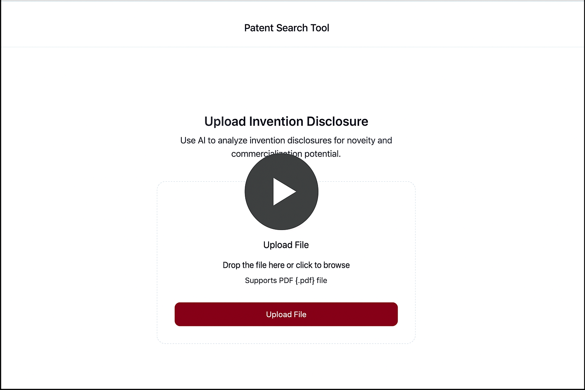
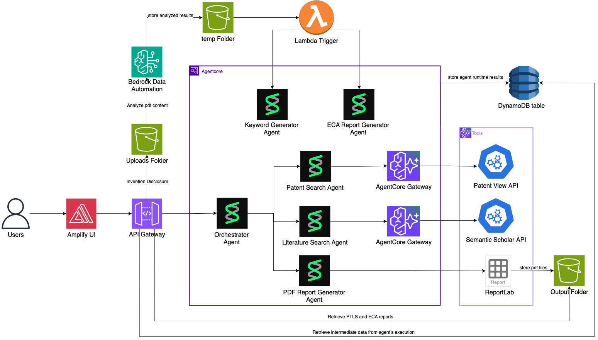

# Patent Novelty Assessment System

An AI-powered patent novelty assessment platform that automates prior art searches across patent databases and academic literature, powered by AWS Bedrock Agent Core and multi-agent orchestration.

## Demo Video

Watch the complete demonstration of the Patent Novelty Assessment System:

  
  
<em>Click the image above to watch the demo (opens in Google Drive)</em>

## Index

| Description           | Link                                                  |
| --------------------- | ----------------------------------------------------- |
| Overview              | [Overview](#overview)                                 |
| Architecture          | [Architecture](#architecture-diagram)                 |
| Detailed Architecture | [Detailed Architecture](docs/architectureDeepDive.md) |
| User Flow             | [User Flow](docs/userGuide.md)                        |
| Deployment            | [Deployment](docs/deploymentGuide.md)                 |
| Usage                 | [Usage](#usage)                                       |
| Infrastructure        | [Infrastructure](docs/architectureDeepDive.md)        |
| Modification Guide    | [Modification Guide](docs/modificationGuide.md)       |
| Credits               | [Credits](#credits)                                   |
| License               | [License](#license)                                   |

## Overview

This application combines AI-powered document processing with intelligent patent and literature search to deliver comprehensive prior art analysis. Built on a serverless architecture with multi-agent orchestration, automated workflow, and professional PDF report generation.

### Key Features

- **Multi-Agent AI System** powered by AWS Bedrock with Claude Sonnet 4.5
- **Automated Document Processing** using Amazon Bedrock Data Automation
- **Intelligent Patent Search** via PatentView API with LLM-powered relevance scoring
- **Academic Literature Search** via Semantic Scholar with semantic evaluation
- **Early Commercial Assessment** for market viability analysis
- **Professional PDF Reports** with prior art analysis and abstracts
- **Real-time Web Interface** with drag-and-drop upload and progress tracking

## Architecture Diagram

The application implements a serverless, event-driven architecture with a multi-agent AI system at its core, combining automated document processing with intelligent search and evaluation.

For a detailed deep dive into the architecture, including core principles, component interactions, data flow, security, and implementation details, see [docs/architectureDeepDive.md](docs/architectureDeepDive.md).

## User Flow

For a detailed overview of the user journey and application workflow, including step-by-step user interactions, see [docs/userGuide.md](docs/userGuide.md).

## Deployment

For detailed deployment instructions, including prerequisites and step-by-step guides, see [docs/deploymentGuide.md](docs/deploymentGuide.md).

## Usage

For detailed post-deployment setup and usage instructions, including configuration steps and how to use the application, see [docs/userGuide.md](docs/usage.md).

## Infrastructure

For a detailed overview of the application infrastructure, including component interactions, AWS services, and data flow, see [docs/architectureDeepDive.md](docs/architectureDeepDive.md).

## Documentation

- **[API Documentation](docs/APIdoc.md)** - Comprehensive API reference for PatentView and Semantic Scholar
- **[API Gateway Endpoints](docs/API_GATEWAY_ENDPOINTS.md)** - Internal API Gateway documentation

## Modification Guide

Steps to implement optional modifications such as changing the Bedrock model, adding more agents, or customizing the frontend can be found [here](docs/modificationGuide.md).

## Credits

This application was architected and developed by [Shaashvat Mittal](https://www.linkedin.com/in/shaashvatm156/), [Sahajpreet Singh](https://www.linkedin.com/in/sahajpreet/), and [Ashik Tharakan](https://www.linkedin.com/in/ashik-tharakan/) with solutions architect [Arun Arunachalam](https://www.linkedin.com/in/arunarunachalam/), program manager [Thomas Orr](https://www.linkedin.com/in/thomas-orr/) and product manager [Rachel Hayden](https://www.linkedin.com/in/rachelhayden/). Thanks to the ASU Cloud Innovation Center Technical and Project Management teams for their guidance and support.

## License

See [LICENSE](LICENSE) file for details.
