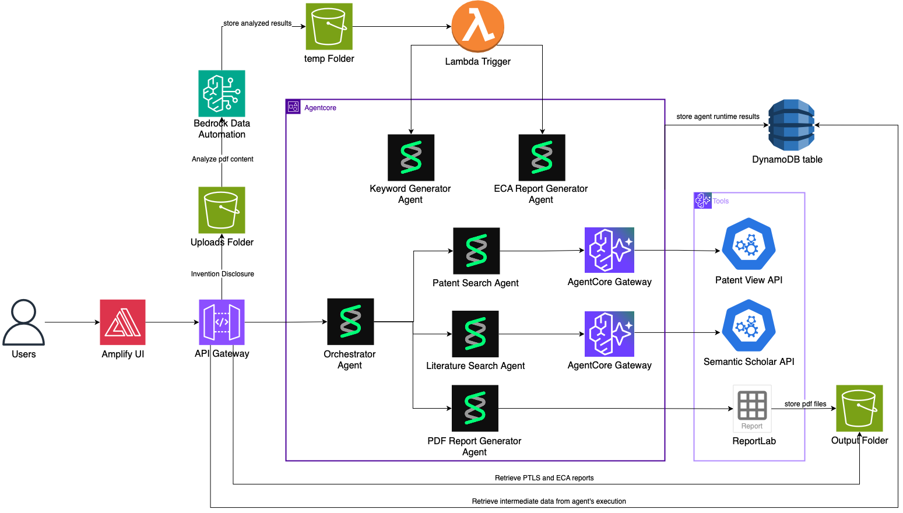

# Architecture Deep Dive

## System Flow

The Patent Novelty Assessment System follows an event-driven, multi-agent architecture that automates the entire prior art search workflow:

### 1. Document Upload
User uploads an invention disclosure PDF to the S3 bucket's `uploads/` folder. This triggers the first Lambda function (`pdf_processor.py`) via S3 event notification.

### 2. Document Processing (BDA)
The PDF Processor Lambda invokes Amazon Bedrock Data Automation (BDA) to extract text, images, and structure from the PDF. BDA processes the document and stores results in the `temp/docParser/` folder as JSON with full text extraction.

### 3. Automatic Agent Triggering
When BDA completes and creates the `result.json` file, an S3 event triggers the Agent Trigger Lambda (`agent_trigger.py`). This Lambda automatically invokes two agents in sequence:
- **Keyword Generator Agent** - Extracts strategic search keywords
- **Commercial Assessment Agent** - Conducts early commercialization analysis

### 4. Keyword Extraction
The Keyword Generator Agent reads the BDA results from S3, analyzes the invention disclosure using Claude Sonnet 4.5, and extracts:
- Invention title
- Technology description
- Technology applications
- 12-15 strategic search keywords

Results are stored in the `patent-keywords` DynamoDB table.

### 5. Patent Search (PatentView)
The Patent Search Agent executes a comprehensive search strategy:
- Reads keywords from DynamoDB
- Parses keywords (detects single words vs. multi-word phrases)
- Searches PatentView database for each keyword (top 10 newest patents per keyword)
- Deduplicates results by patent ID
- Pre-filters to top 50 patents by citation count
- Uses LLM to evaluate each patent's relevance (semantic analysis of abstracts)
- Stores top 6-8 most relevant patents in `patent-search-results` DynamoDB table

### 6. Academic Literature Search (Semantic Scholar)
The Scholarly Article Agent conducts an intelligent search:
- Reads invention context from DynamoDB
- Uses LLM to generate 4-5 strategic search queries
- Executes searches with adaptive query refinement
- Applies LLM-powered semantic relevance evaluation to each paper's abstract
- Keeps only papers with LLM score ≥ 7 and decision = "KEEP"
- Stores top 5-8 semantically relevant papers in `scholarly-articles-results` DynamoDB table

### 7. Early Commercial Assessment
The Commercial Assessment Agent analyzes commercialization potential:
- Reads BDA results from S3
- Analyzes invention across 10 dimensions (problem solved, market overview, competition, potential licensees, challenges, etc.)
- Generates comprehensive assessment using Claude Sonnet 4.5
- Stores results in `early-commercial-assessment` DynamoDB table

### 8. Report Generation
The Report Generator creates two professional PDF reports:
- **Novelty Report** - Patent and literature search results with abstracts
- **ECA Report** - Early commercial assessment findings

Reports are generated using ReportLab and stored in the S3 `reports/` folder.

### 9. Report Delivery
Users download PDF reports from S3 for review by patent examiners and technology transfer professionals.

## Cloud Services / Technology Stack

- **Amazon S3**: Object storage for documents and reports
  - `uploads/` - Invention disclosure PDFs uploaded by users
  - `temp/docParser/` - BDA processing results (JSON with extracted text)
  - `reports/` - Generated PDF reports (novelty and ECA)

- **AWS Lambda Functions**:
  - **pdf_processor** - Triggered on PDF upload, invokes BDA for document processing
  - **agent_trigger** - Triggered when BDA completes, automatically invokes keyword and ECA agents

- **Amazon Bedrock Data Automation (BDA)**: AI-powered document processing
  - Extracts text, images, and structure from PDFs
  - Outputs JSON with full document representation
  - Configured for DOCUMENT, PAGE, and ELEMENT granularity

- **AWS Bedrock Agent Core**: Multi-agent orchestration platform
  - Hosts the Patent Novelty Orchestrator runtime (Docker container)
  - Routes requests to specialized agents based on action type
  - Manages agent lifecycle and streaming responses

- **Amazon Bedrock (Claude Sonnet 4.5)**: Large Language Model for AI analysis
  - Keyword extraction and strategic search term generation
  - Patent relevance evaluation (semantic analysis of abstracts)
  - Academic paper relevance scoring
  - Commercial assessment analysis

- **Amazon DynamoDB Tables**:
  - **patent-keywords** - Stores invention metadata and search keywords (partition key: pdf_filename, sort key: timestamp)
  - **patent-search-results** - Stores relevant patents from PatentView (partition key: pdf_filename, sort key: patent_number)
  - **scholarly-articles-results** - Stores relevant academic papers (partition key: pdf_filename, sort key: article_doi)
  - **early-commercial-assessment** - Stores commercialization analysis (partition key: pdf_filename, sort key: timestamp)

- **PatentView API Gateway**: OAuth-secured access to USPTO patent database
  - Searches granted US patents
  - Returns patent metadata, abstracts, inventors, assignees, citations
  - Accessed via MCP (Model Context Protocol) Gateway

- **Semantic Scholar API Gateway**: OAuth-secured access to academic paper database
  - Searches 200M+ research papers
  - Returns paper metadata, abstracts, authors, citations
  - Accessed via MCP (Model Context Protocol) Gateway

- **AWS IAM Roles**:
  - **Lambda Execution Role** - Permissions for S3, BDA, and Agent Core invocation
  - **Agent Runtime Role** - Permissions for S3, DynamoDB, Bedrock, and CloudWatch

- **Amazon ECR (Elastic Container Registry)**: Stores Docker image for Agent Core Runtime
  - Patent Novelty Orchestrator image with all agent implementations
  - Built with multi-architecture support (ARM64/X86_64)

## Infrastructure as Code

The entire infrastructure is defined using **AWS CDK (Cloud Development Kit)** in TypeScript:

- **patent-novelty-stack.ts** - Main CDK stack defining all resources
  - S3 bucket with event notifications
  - Lambda functions with appropriate triggers
  - DynamoDB tables with pay-per-request billing
  - IAM roles and policies
  - Docker image asset for Agent Core
  - Environment variable configuration

- **deploy.sh** - Automated deployment script
  - Creates BDA project (or uses existing)
  - Installs Node.js dependencies
  - Deploys CDK stack with BDA project ARN as context
  - Provides post-deployment instructions for Agent Core setup

The CDK approach enables:
- Version-controlled infrastructure
- Repeatable deployments across environments
- Automatic resource dependency management
- Type-safe infrastructure definitions

## Agent Architecture

The system uses a **multi-agent architecture** with specialized agents:

### Orchestrator Agent
- Routes requests to appropriate agents based on action type
- Handles streaming responses from agents
- Manages error handling and retries
- Supports actions: `generate_keywords`, `search_patents`, `search_articles`, `commercial_assessment`, `generate_report`

### Keyword Generator Agent
- Analyzes invention disclosures like a patent search professional
- Extracts 12-15 high-quality keywords for prior art searches
- Generates invention title, technology description, and applications
- Uses structured output format for DynamoDB storage

### Patent Search Agent
- Implements intelligent search strategies (single words, multi-word phrases)
- Deduplicates and pre-filters results by citation count
- Uses LLM for semantic relevance evaluation of patent abstracts
- Scores patents on 0-1 scale with detailed examiner notes

### Scholarly Article Agent
- Generates strategic search queries using LLM
- Implements adaptive query refinement based on result quality
- Applies LLM-powered semantic relevance filtering
- Keeps only papers with proven technical overlap (score ≥ 7)

### Commercial Assessment Agent
- Analyzes 10 commercialization dimensions
- Generates non-confidential marketing abstracts
- Identifies potential licensees and competitors
- Assesses market size, challenges, and key assumptions

### Report Generator
- Creates professional PDF reports using ReportLab
- Novelty Report: Patent and literature search results with abstracts
- ECA Report: Comprehensive commercial assessment
- Includes legal disclaimers and AI-generated content warnings

## Security & Access Control

- **S3 Bucket**: Block all public access, versioning disabled, auto-delete on stack removal
- **Lambda Functions**: Least-privilege IAM roles with specific resource permissions
- **DynamoDB**: Encrypted at rest, pay-per-request billing (no provisioned capacity)
- **Agent Core Runtime**: IAM role with permissions for S3, DynamoDB, Bedrock, and CloudWatch
- **API Gateways**: OAuth 2.0 client credentials flow for PatentView and Semantic Scholar
- **Environment Variables**: Sensitive credentials stored in Agent Core Runtime configuration (not in code)

## Scalability & Performance

- **Serverless Architecture**: Automatically scales with demand, no server management
- **Event-Driven Processing**: Asynchronous workflows with S3 event triggers
- **DynamoDB**: NoSQL database with automatic scaling and single-digit millisecond latency
- **Lambda Concurrency**: Handles multiple PDF uploads simultaneously
- **Agent Streaming**: Real-time streaming responses from agents for better UX
- **Rate Limiting**: Built-in rate limiting for external API calls (1.5 second delays for Semantic Scholar)

## Monitoring & Observability

- **CloudWatch Logs**: All Lambda and Agent Core logs automatically captured
- **CloudWatch Metrics**: Lambda invocations, errors, duration, and throttles
- **DynamoDB Metrics**: Read/write capacity, throttles, and latency
- **S3 Metrics**: Object counts, storage size, and request metrics
- **Agent Core Logs**: Detailed agent execution logs with tool calls and LLM responses
