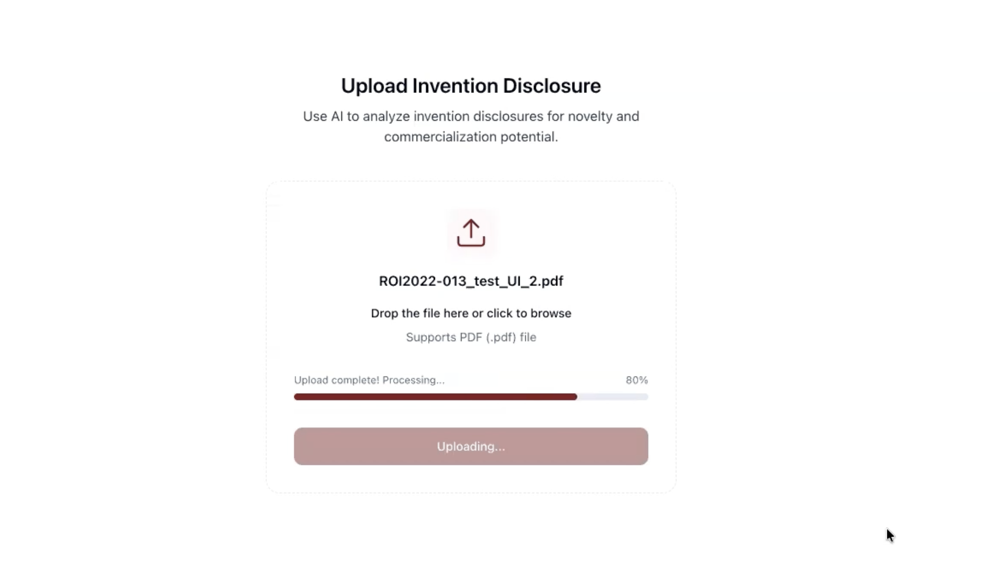
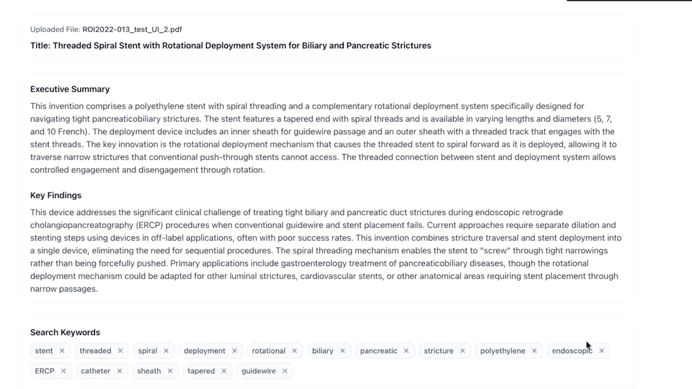
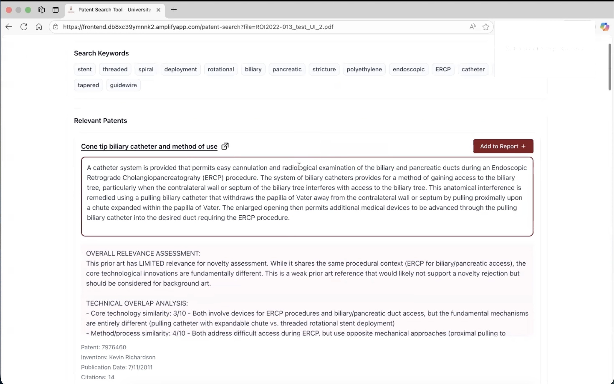
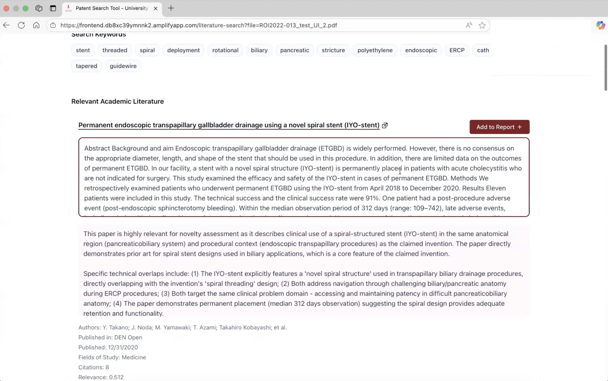
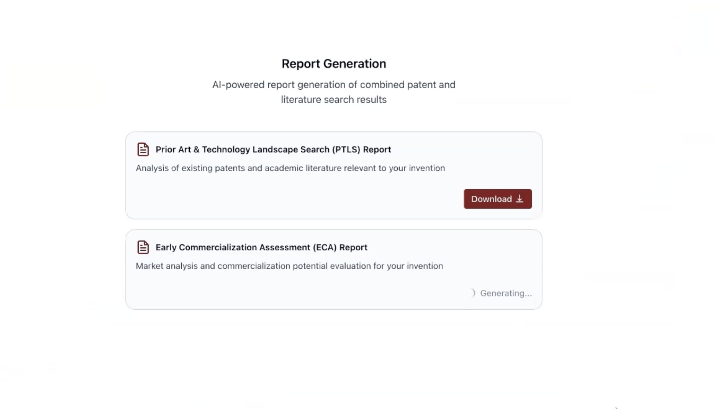

# User Guide

**Please ensure the application is deployed using the instructions in the deployment guide:**
- [Deployment Guide](./deploymentGuide.md)

Once you have deployed the solution, this user guide will help you navigate the available functions and features.

## Overview

The Patent Novelty Assessment System provides automated prior art search and analysis for invention disclosures. The system:

- **Analyzes Invention Disclosures**: Extracts keywords and technical details from PDF documents
- **Searches Patent Databases**: Finds relevant prior art patents using AI-powered search
- **Searches Academic Literature**: Discovers relevant research papers and articles
- **Generates Professional Reports**: Creates examiner-ready PDF reports for patent assessment

The system uses specialized AI agents that automatically process your invention disclosure and provide comprehensive prior art analysis with professional reports.

**Important Disclaimer**: This tool provides preliminary prior art analysis and should not replace professional review. Please review every detail professionally before trusting the results.

## Getting Started

### Accessing the Application

After deployment, you'll receive:
1. **Frontend URL**: The web application for uploading and viewing results
2. **API Gateway URL**: Backend API endpoint (for developers)

Navigate to the Frontend URL to start using the patent novelty assessment system.

## Features

### 1. Document Upload and Processing

The system automatically processes your invention disclosure through multiple AI agents:

**Keyword Extraction Agent**:
- Analyzes your invention disclosure
- Extracts strategic search keywords (12-15 keywords)
- Generates invention title and technology description

**Patent Search Agent**:
- Searches PatentView database for relevant patents
- Uses AI to evaluate patent relevance
- Ranks results by relevance score

**Literature Search Agent**:
- Searches Semantic Scholar for academic papers
- Applies semantic relevance filtering
- Identifies most relevant research

### 2. File Upload Process

**Upload Requirements**:
- **File Type**: PDF only
- **Content**: Must contain text (not scanned images)
- **Security**: No password-protected PDFs

**Upload Process**:
1. Drag and drop your PDF file onto the upload area
2. Or click to browse and select your file
3. Watch the upload progress bar
4. Wait for processing to complete

### 3. Processing Status and Timing

**Processing Times**:
- **Document Upload**: 3-5 seconds
- **Keyword Extraction**: 15 seconds
- **Patent Search**: 12-15 minutes
- **Literature Search**: 10-15 minutes
- **Report Generation**: 3-4 seconds

**Total Time**: Usually 25-30 minutes for complete results

**What to Expect**:
- Progress indicators show current processing stage
- You can navigate away and return later
- Results appear automatically when ready
- If taking longer than 45 minutes, try refreshing

### 4. Viewing Analysis Results

**Keywords Results**:
- Shows extracted keywords and analysis
- Displays invention title and technology description
- Provides technology applications

**Patent Search Results**:
- Lists relevant patents found
- Shows relevance scores and patent details
- Includes patent abstracts and citations

**Literature Search Results**:
- Displays relevant academic papers
- Shows paper abstracts and authors
- Includes publication details and citations

### 5. Generated Reports

**Two Professional PDF Reports**:

**Novelty Report**:
- Case information and extracted keywords
- Patent search results with abstracts
- Literature search results with abstracts
- Detailed prior art analysis
- Legal disclaimer

**ECA Report (Early Commercial Assessment)**:
- Problem solved and solution offered
- Technology details and applications
- Market overview and competition analysis
- Potential licensees and commercialization challenges
- Key assumptions and recommendations

### 6. Navigation and Results Access

**Results Navigation**:
- **Keywords**: View extracted keywords and analysis
- **Patent Search**: Review patent search results
- **Literature Search**: Examine academic paper results
- **Reports**: Download generated PDF reports

**Results Access**:
- Results are saved and accessible anytime
- No time limits on viewing results
- Can download reports multiple times

## Usage Tips

### Getting Better Results

**Document Quality**:
- Use text-based PDFs (not scanned images)
- Include clear technical descriptions
- Provide specific details about mechanisms and materials
- Describe the problem being solved

**Understanding Results**:
- Review relevance scores to identify most important prior art
- Focus on patents and papers with higher relevance scores
- Consider publication dates and citation counts
- Use results as starting point for deeper analysis

### Common Error Messages

**"Only PDF files are supported"** → Upload a PDF file
**"File too large"** → Try uploading a different PDF file
**"Upload failed"** → Check internet connection and try again
**"Results not found"** → Processing isn't done yet, wait longer
**"Reports not ready"** → Wait for processing to complete

## Troubleshooting

### Upload Issues

**File Upload Fails**:
- Check file format (PDF only)
- Ensure stable internet connection
- Try a different browser

**Processing Stuck**:
- Wait up to 45 minutes before refreshing
- Check if file contains extractable text
- Try uploading a different PDF

### Results Issues

**Results Not Loading**:
- Refresh the page
- Check browser console for errors
- Verify internet connection

**Reports Not Generating**:
- Ensure processing is complete
- Wait for all search results to finish
- Try regenerating reports

### Getting Help

**If Problems Persist**:
1. Try using Chrome browser
2. Clear browser cache and cookies
3. Check internet connection stability
4. Try uploading a different PDF file
5. Wait longer for processing to complete

## Next Steps

After reviewing your results:

1. **Professional Review**: Use novelty report for patent filing decisions
2. **Commercial Assessment**: Use ECA report for business development
3. **Further Analysis**: Conduct deeper research on identified prior art
4. **Refine Invention**: Update disclosure based on findings
5. **Patent Strategy**: Proceed with filing or licensing discussions

**Remember**: This tool provides preliminary analysis. Please review every detail professionally before trusting the results and making final decisions.